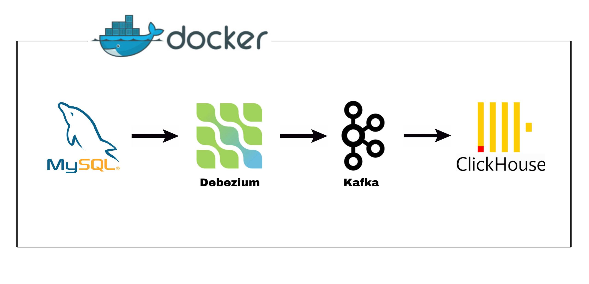

# Real-Time Data Pipeline using MySQL, Apache Kafka, and ClickHouse

This project demonstrates a real-time data integration pipeline that captures changes from a MySQL database and streams them into ClickHouse using Kafka Connect.



## 🔧 Technologies Used

- **MySQL**: Source database for capturing real-time data.
- **Apache Kafka**: Message broker for handling streaming data.
- **Kafka Connect**:
  - **Source Connector**: Captures changes from MySQL using Debezium.
  - **Sink Connector**: Writes streamed data into ClickHouse.
- **ClickHouse**: Fast columnar OLAP database for analytics.
- **Docker**: Containerized environment for easy setup and reproducibility.

## 📁 Project Structure

├── connectors/
│ ├── mysql 
| |     └── mysql-source-connector.json       # Kafka Connect config for MySQL
│ └── clickhouse 
|       └── clickhouse-sink-connector.json    # Kafka Connect config for ClickHouse
├── plugins/                                  # Directory for custom Kafka Connect plugins
├── sql-script/                               # Directory for MySQL DB script
├── images/                                   # Pipline diagram and project images
└── README.md                                 # Project documentation


## 🚀 How It Works

1. **MySQL Source Connector** captures data changes from MySQL tables in real-time.
2. Changes are published to **Kafka topics**.
3. **ClickHouse Sink Connector** subscribes to those topics and writes the data into **ClickHouse tables**.
4. Data is now ready for real-time querying and analytics.

## ✅ Prerequisites

- Docker & Docker Compose
- MySQL database with test data
- Kafka Connect image with required plugins installed

## 📌 Usage

1. Clone this repo:
   ```bash
   git clone https://github.com/your-username/real-time-mysql-clickhouse-pipeline.git
   cd real-time-mysql-clickhouse-pipeline

2. Make sure the Kafka Connect container includes the ClickHouse Sink Connector in the /plugins directory.

3. Start your Docker environment.

4. Apply the connectors:
   ```bash
   curl -sS -X POST -H "Accept:application/json" -H "Content-Type:application/json" \http://localhost:8083/connectors/ -d @connectors/mysql-source-connector.json | jq

   curl -sS -X POST -H "Accept:application/json" -H "Content-Type:application/json" \http://localhost:8083/connectors/ -d @connectors/clickhouse-sink-connector.json | jq

5. Verify that data from MySQL is being streamed into ClickHouse.

## 📊 Example Use Case
E-commerce Analytics: Stream users, orders, and products data from MySQL to ClickHouse to power real-time dashboards and business intelligence.

